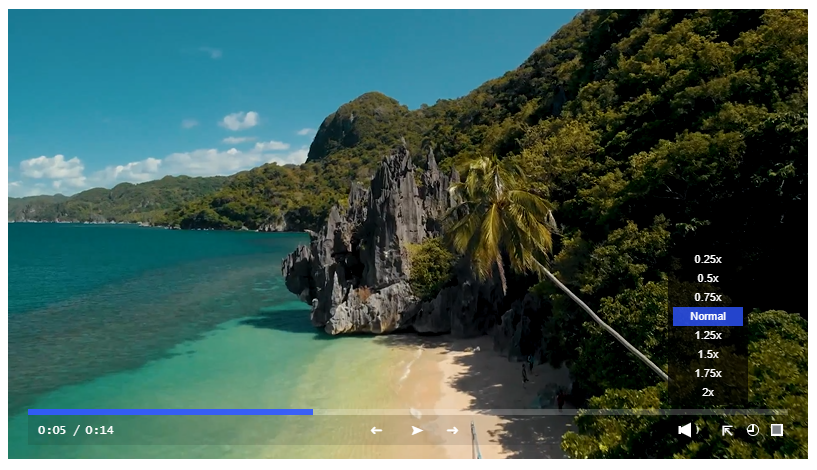
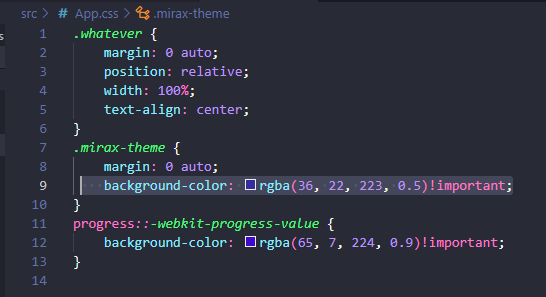

<p align="center">
      
</p>

# Mirax Player 

[](https://www.npmjs.com/package/mirax-player)

-------------

<p align="center">
  
</p>

---------
<p align="center">
  
</p>

--------
<p align="left">
  
</p>
-------------

## Table of Contents

- [Description](#description)
- [Installation](#installation)
- [Usage](#usage)
- [React](#react)
- [Vue](#vue)
- [Angular](#angular)
- [Svelte](#svelte)
- [Style](#style)
- [Colors](#colors)
- [Features](#features)
- [License](#license)
- [Author](#author)

## Description

Mirax Player is a free javascript video player for React, Vue, Angular and Svelte.
You can customize the theme color as much as you like. 
Responsive and easy to implement with readability, easy to configurize and light-weight.


------------
Compatibility for web browsers:
---------


-------------
## Installation

To install the Mirax Player, you can use the following npm command:

```bash
npm install mirax-player
```
## Usage

In your component

------------------

Then use it  from Mirax Player:

```js

//both react,vue, angular and svelte importing syntax

import { mirax } from 'mirax-player';

// for react (video file stored: public/clip.mp4)
  const [isPlaying, setIsPlaying] = useState(false);
  const player = useRef(null);
//
// for vue (video file stored: public/clip.mp4)
    const isPlaying = ref(false);
    const player = ref(null);
//
// for angular (video file stored: src/assets/clip.mp4)
  @ViewChild('player', { static: true })
  isPlaying: boolean = false;
//
// for svelte (video file stored: public/clip.mp4)
   let isPlaying = false;
   let player;
//

```

------------
## React

In your React component

------------------

You need to use useRef in React hooks:
-----------
```js

import React, { useEffect, useState, useRef } from 'react';
import { mirax } from 'mirax-player';

const ExampleComponent = () => {
  const [isPlaying, setIsPlaying] = useState(false);
  const player = useRef(null);

  useEffect(() => {
    if (player.current) {
      mirax(player.current, isPlaying, setIsPlaying);
    }
  }, [isPlaying]);

  return (
    <div>
      <div className='whatever'>
        <video ref={player} className="mirax" src="clip.mp4"></video>
      </div>
    </div>
  );
};

export default ExampleComponent;


```
------------
## Vue

In your Vue component

------------------

You need to use ref in Vue attributes:
-----------
```js

<template>
  <div>
    <div class="whatever">
      <video ref="player" class="mirax" src="clip.mp4"></video>
    </div>
  </div>
</template>

<script>
import { ref, onMounted, watch } from 'vue';
import { mirax } from 'mirax-player';

export default {
  name: 'ExampleComponent',
  setup() {
    const isPlaying = ref(false);
    const player = ref(null);

    onMounted(() => {
      if (player.value) {
        mirax(player.value, isPlaying.value, setIsPlaying);
      }
    });

    watch(isPlaying, () => {
      if (player.value) {
        mirax(player.value, isPlaying.value, setIsPlaying);
      }
    });

    function setIsPlaying(value) {
      isPlaying.value = value;
    }

    return {
      player
    };
  }
};
</script>

```

------------
## Angular

In your Angular component

------------------

You need to use ElementRef native DOM element:
---------
example.component.ts
-----------
```js

import { Component, ElementRef, OnInit, ViewChild } from '@angular/core';
import { mirax } from 'mirax-player';

@Component({
  selector: 'app-example',
  templateUrl: './example.component.html',
  styleUrls: ['./example.component.css']
})
export class ExampleComponent implements OnInit {
  @ViewChild('player', { static: true }) player!: ElementRef<HTMLVideoElement>;

  isPlaying: boolean = false;

  ngOnInit(): void {
    this.initializeMirax();
  }

  initializeMirax() {
    if (this.player.nativeElement) {
      const miraxPlayer = new mirax(this.player.nativeElement, this.isPlaying, this.setIsPlaying.bind(this));
      miraxPlayer.init();
    }
  }

  setIsPlaying(value: boolean) {
    this.isPlaying = value;
  }
}

```
--------------------------------------
example.component.html
-------------

```html


<div>
  <div class="whatever">
    <video #player class="mirax" src="assets/clip.mp4"></video>
  </div>
</div>


```
------------
## Svelte

In your Svelte component

------------------

You need to use bind:this in svelte:
-----------
```js

<script>
    import { onMount } from 'svelte';
    import { mirax } from 'mirax-player';
  
    let isPlaying = false;
    let player;
  
    onMount(() => {
      if (player) {
        mirax(player, isPlaying, current => {
          isPlaying = current;
        });
      }
    });
</script>
  
  <div>
    <div class='whatever'>
      <video bind:this={player} class="mirax" src="clip.mp4">
        <track kind="captions" src="" label="English" default>
      </video>
    </div>
  </div>

```
--------------------------------------

To customize the alignment of video:
-----

- note: .whatever, you can rename it, just make sure the classname in your component also replace it.
---------
```js
// in React 
 <div className='whatever'>
        <video ref={player} className="mirax" src="clip.mp4"></video>
</div>

// in Vue 
<div class="whatever">
      <video ref="player" class="mirax" src="clip.mp4"></video>
 </div>

// in Angular
  <div class="whatever">
    <video #player class="mirax" src="assets/clip.mp4"></video>
  </div>

```
----------
## Style

You can set your own class name to wrap the video player
----------------------------

```css
.whatever {
    margin: 0 auto;
    position: relative;
    width: 100%;
}

```
--------------
## Colors

You have freedom to set a theme color for free.
----------------------------
To change color and theme, just add to your css file
---------
-note always put !important at the end of statement.

```css


.mirax-theme {
    background-color: rgba(4, 88, 25, 0.2)!important;
}
progress::-webkit-progress-value {
    background-color: rgb(252, 227, 7)!important;
} 

```
---------------------------
color css syntax supported:
------
- rgba() -> means have opacity  add: !important;
- rgb() -> means no opacity  add: !important;
- hexa  -> starts with # symbol ex. #00ff00  add: !important;
- colorname -> specific name:  ex. red, blue, purple add: !important;
----------------

## Features

- Play and Pause
- Responsive
- Can play videos (Portrait or Landscape)
- 9:16 dimension supported (Mobile video)
- Fullscreen
- Adjust the volume (low or high)
- Can change color themes
- You can point and drag the timestamp in video time duration anywhere
- PIP supported (picture in picture) will play the clip even if you leave the tab open for new app 

----------------------------------------------------
## License

MIT

----------------------------------------------------
## Author

Demjhon Silver


